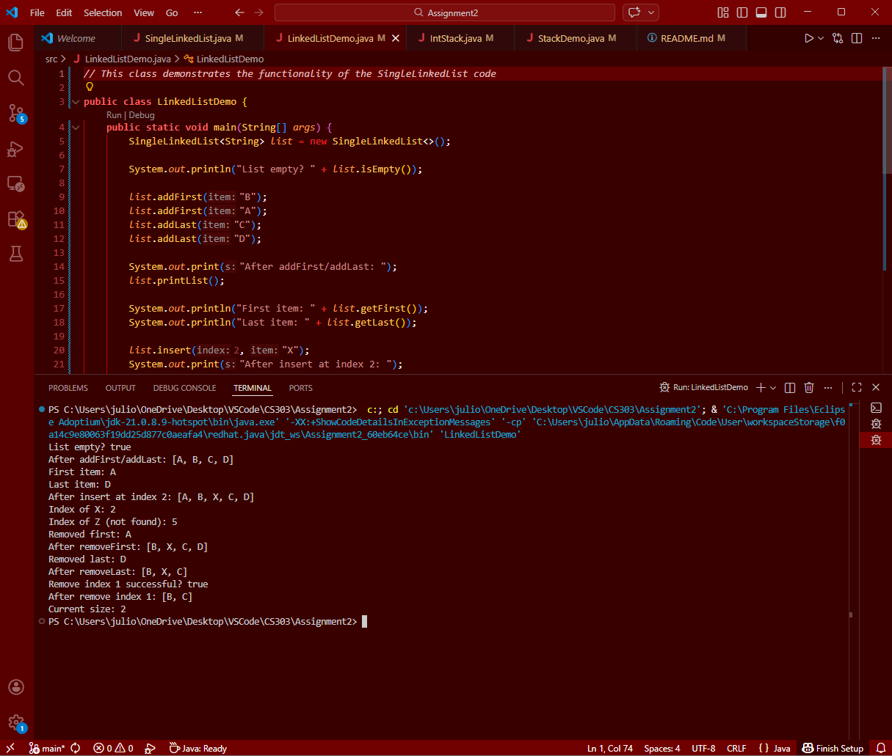
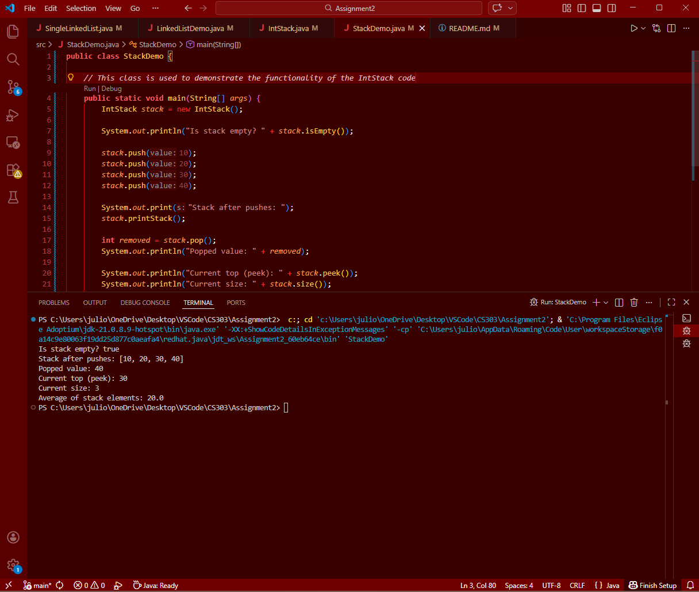

# CS-303 Assignment 2

## Name
Julio Villarreal

## Design Explanation

For the singly linked list class I implemented a generic singly linked list using a node class that stores data and the reference to the next node.
The list uses:
1. head for the first element
2. tail for the last element
3. size to keep track of the number of elements
The methods implemented such as add, remove, etc. function utilizing node references

For the class meant to implement a stack using 'ArrayList<Integer>'.
The top of the stack is represented using the end of the list.
1. push() adds to the end of the list
2. pop() removes the element at the end of the list
3. peek() returns the last element

## how to run

1. Clone or download this repository
2. Open the project in an IDE such as IntelliJ or VS Code
3. Run 'LinkedListDemo.java' or Run 'StackDemo.java'

## Examples of functioning methods with screenshots

1. Example of 'LinkedListDemo' output

2. Example of 'StackDemo' output

